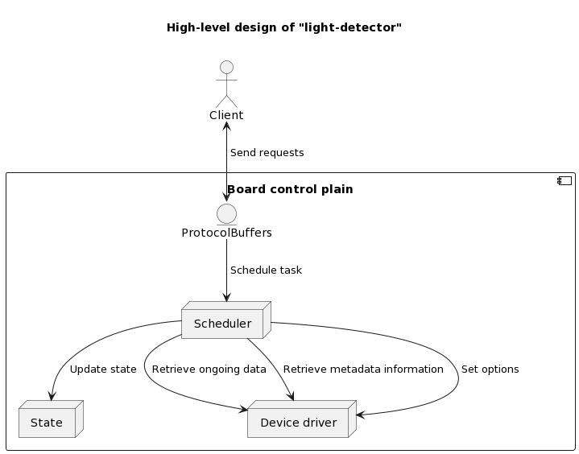

# light-detector

[](https://github.com/YarikRevich/light-detector/actions/workflows/build.yml)

[](https://github.com/vshymanskyy/StandWithUkraine/blob/main/docs/README.md)

## General Information

A driver-like application, which allows to communicate with **TSL2591X** light sensor, based on **STM32L476RG** embedded system.

Includes following features:
* Retrieve latest sensor data(**raw**, **full**, **infrared**, **visible**)
* Retrieve meta information from the internal board state
* Modify settings for the light sensor.



## Setup

First of all connect your device to the board using pin-out given below. Then connect your board to serial port.


In order to build **IOC** project using **light_detector.ioc** file it's required to use **STM CubeMX** to generate **ELF** file and upload it with the help of
**STM Programmer**.

All supportive setup related operations are processed via **Makefile** placed in the project root directory.

> If **ProtocolBuffers** bindings need to be regenerated it's required to execute the following command:
```shell
make generate
```

After successful installation, the board should signalize successful connection with the device:


## Scripts

### CLI

Detailed documentation can be found [here](./Scripts/cli/README.md)
