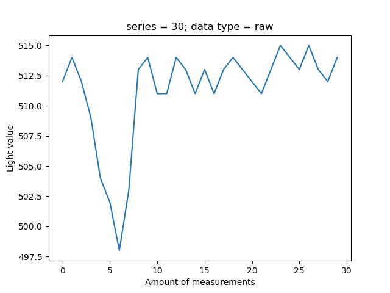
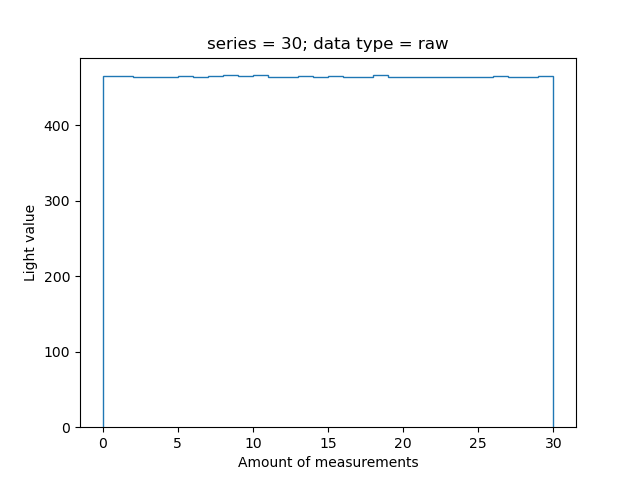
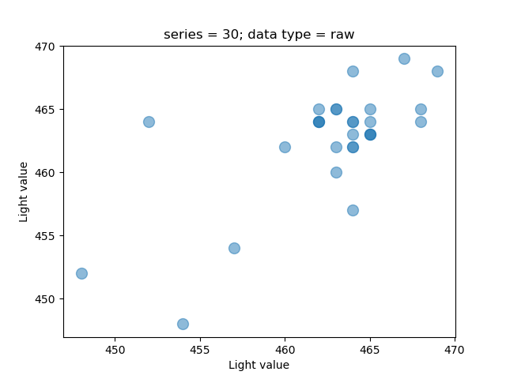

# CLI


[](https://github.com/vshymanskyy/StandWithUkraine/blob/main/docs/README.md)

## General Information

Allows to perform operations with serial connected devices.

Includes following features:
* Retrieve latest sensor data(**raw**, **full**, **infrared**, **visible**)
* Retrieve meta information from the internal board state
* Modify settings for the light sensor.

All the operations are perform with the usage of **ProtocolBuffers**.

## Setup

Your board needs to have already installed software build, which allows communication with **TSL2591X** device. 
The device should be connected.

All setup related operations are processed via **Makefile** placed in the root directory.

In order to build the project it's required to execute the following command. It generates local **Python** project.
```shell
make install
```

# Use Cases

Most of the commands given below require **baud rate**. It is important to be the exact-supported value,
otherwise requests will be ignored(in the given examples baud rate is equal to **9600**).

## Get Available Devices

The example below shows how to retrieve a set of all available devices, which can be used to perform other operations.
```shell
$ light-detector-cli get_available_devices

[
  instance(AvailableDevicesDto):
    description: 'STM32 STLink',
    location: '/dev/cu.usbmodem1203',
    manufacturer: 'STMicroelectronics'
]
```

## Get Info

The examples below show all the possible ways to retrieve metadata information from the board. Baud rate is important to be the exact-supported value,
otherwise requests will be ignored(in the given examples baud rate is equal to **9600**).

### Gain

The next example shows how to retrieve the value of gain metadata information from the board.
```shell
$ light-detector-cli get_info --device="/dev/cu.usbmodem1203" --baud_rate="9600" --type="gain"

instance(RetrievedInfoDto):
  data_type: <InfoTypeCompound.GAIN: 'Gain'>,
  device_id: 80,
  nonce: 4,
  value: 16
```

Available **gain** values:
* 0 - low
* 16 - medium
* 32 - high
* 48 - max

### Integral Time

The next example shows how to retrieve the value of integral time metadata information from the board. 
```shell
$ light-detector-cli get_info --device="/dev/cu.usbmodem1203" --baud_rate="9600" --type="integral_time"

instance(RetrievedInfoDto):
  data_type: <InfoTypeCompound.INTEGRAL_TIME: 'IntegralTime'>,
  device_id: 80,
  nonce: 5,
  value: 1
```

Available **integral time** values:
* 0 - 100ms
* 1 - 200ms
* 2 - 300ms
* 3 - 400ms
* 4 - 500ms
* 5 - 600ms

### Processed Requests

The next example shows how to retrieve the value of processed requests(amount of successful incoming requests, different from nonce) metadata information from the board.
```shell
$ light-detector-cli get_info --device="/dev/cu.usbmodem1203" --baud_rate="9600" --type="processed_requests"

instance(RetrievedInfoDto):
  data_type: <InfoTypeCompound.PROCESSED_REQUESTS: 'ProcessedRequests'>,
  device_id: 80,
  nonce: 6,
  value: 20
```

### Device Available

The next example shows how to retrieve the value of device available metadata information from the board.
```shell
$ light-detector-cli get_info --device="/dev/cu.usbmodem1203" --baud_rate="9600" --type="device_available"

instance(RetrievedInfoDto):
  data_type: <InfoTypeCompound.DEVICE_AVAILABLE: 'DeviceAvailable'>,
  device_id: 80,
  nonce: 7,
  value: 1
```

Available **device available** values:
* 1 - device available
* 0 - device is not available

## Set settings

The examples below show all the possible ways to modify device settings. Baud rate is important to be the exact-supported value,
otherwise requests will be ignored(in the given examples baud rate is equal to **9600**).

Successful operation will be signalized with LED blinking.


### Reset

The next example shows how to reset all the settings of the device
```shell
$ light-detector-cli set_settings --device="/dev/cu.usbmodem1203" --baud_rate="9600" --type="reset"

instance(SetSettingsDto):
  device_id: 80,
  nonce: 5,
  result: True,
  settings_type: <SettingsTypeCompound.RESET: 'Reset'>
```

### Set Gain

The next example shows how to modify gain setting of the device.
```shell
$ light-detector-cli set_settings --device="/dev/cu.usbmodem1203" --baud_rate="9600" --type="set_gain" --value="low"

instance(SetSettingsDto):
  device_id: 80,
  nonce: 7,
  result: True,
  settings_type: <SettingsTypeCompound.SET_GAIN_LOW: 'SetGainLow'>
```

Available **set_gain** values:
* low - 0
* medium - 16
* high - 32
* max - 48

### Set Integral Time

The next example shows how to modify integral time setting of the device.
```shell
$ light-detector-cli set_settings --device="/dev/cu.usbmodem1203" --baud_rate="9600" --type="set_integral_time" --value="first"

instance(SetSettingsDto):
  device_id: 80,
  nonce: 8,
  result: True,
  settings_type: <SettingsTypeCompound.SET_INTEGRAL_TIME_FIRST: 'SetIntegralTimeFirst'>
```

Available **set_integral_time** values:
* first - 100ms
* second - 200ms
* third - 300ms
* forth - 400ms
* fifth - 500ms
* sixth - 600ms

## Get data

The examples below show all the possible ways to retrieve data information from the board.

```shell
$ light-detector-cli get_data --device="/dev/cu.usbmodem1203" --baud_rate="9600" --type="raw"

[
  instance(RetrievedDataDto):
    data_type: <DataTypeCompound.RAW: 'Raw'>,
    device_id: 80,
    nonce: 4,
    value: 121
]
```

In the same way other types of data can be retrieved, all the available data types are given below:
* raw
* full
* infrared
* visible

It's also possible to have a series of measurements, in order to archive that it's important to add **series** parameter.

```shell
$ light-detector-cli get_data --device="/dev/cu.usbmodem1203" --baud_rate="9600" --type="raw" --series=4

[
  instance(RetrievedDataDto):
    data_type: <DataTypeCompound.RAW: 'Raw'>,
    device_id: 80,
    nonce: 26,
    value: 51
  instance(RetrievedDataDto):
    data_type: <DataTypeCompound.RAW: 'Raw'>,
    device_id: 80,
    nonce: 27,
    value: 80
  instance(RetrievedDataDto):
    data_type: <DataTypeCompound.RAW: 'Raw'>,
    device_id: 80,
    nonce: 28,
    value: 97
  instance(RetrievedDataDto):
    data_type: <DataTypeCompound.RAW: 'Raw'>,
    device_id: 80,
    nonce: 29,
    value: 41
]
```

Having a series of measurements it becomes possible to create a diagram to more easily observe output changes. In
order to do that it's needed to add **export**(describes a location of output diagram file) and **figure**(describes a type of the diagram) 
parameters.

```shell
$ light-detector-cli get_data --device="/dev/cu.usbmodem1203" --baud_rate="9600" --type="raw" --series=4 --export="./output" --figure="plot"

...
```

Available **figure** values:
* plot
* stairs
* scatter

#### Plot



#### Stairs



#### Scatter

